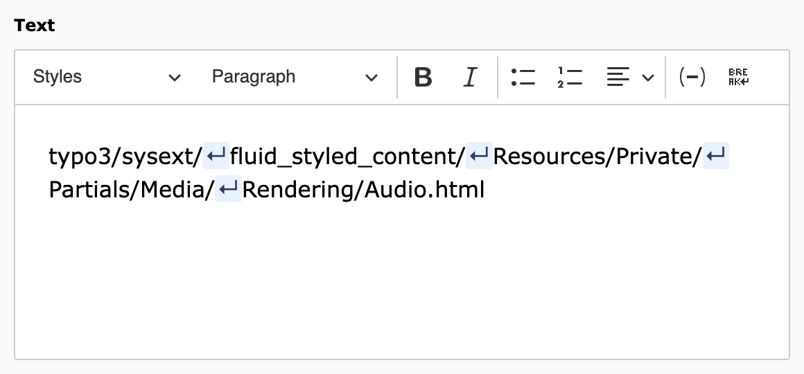
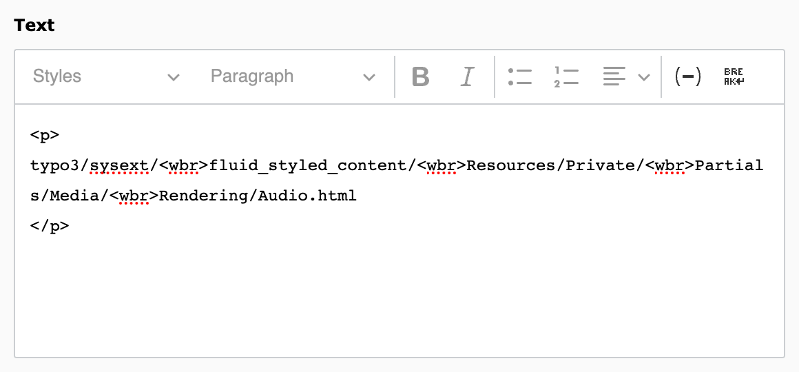

# CKEditor 5: wordbreak Plugin (TYPO3 Extension)

## Compatibility

TYPO3 12.4.0 - 12.4.99

## What does this extension do?

- This extension provides general support for the `<wbr>` HTML element in CKEditor 5 and TYPO3 v12
- Editors can insert the element by pressing a button at the current cursor position
- All `<wbr>` elements are highlighted in the editor (similar to the softhyphen)

## `<wbr>`: The Line Break Opportunity element

* Allows a line break **without** adding a hyphen to the wrapped string
* Useful e.g. for long URLs or file paths, displayed on mobile websites or inside narrow parent elements

Line breaks are **only** applied by browsers if the word is too long for the surrounding element or viewport.

Further information: https://developer.mozilla.org/en-US/docs/Web/HTML/Element/wbr

## Screenshots

### CKEditor in TYPO3 backend: Highlighted line breaks in editor UI



The `<wbr>` elements are highlighted with an arrow on a colored background
(similar to the soft-hyphen in TYPO3's editor).

### CKEditor in TYPO3 backend: HTML source view



In the source editing mode, `<wbr>` elements are visible in the HTML.

### Frontend view (small viewport): Applied line breaks


In the frontend, the browser adds line breaks to the text where `<wbr>` elements are set
(but only where necessary).

## Installation

`composer req sebkln/ckeditor-wordbreak`

The extension needs to be installed as any other extension of TYPO3 CMS.

Perform the following steps:

1. Load and install the extension
2. Include the static template *"CKEditor plugin: wordbreak"* into your TypoScript template
3. Extend your CKEditor configuration (see below)

### CKEditor configuration

```
editor:
  config:
    # 1. Import the plugin:
    importModules:
      - '@sebkln/ckeditor/wordbreak.js'

    toolbar:
      items:
        # 2. Add the button to your existing list of toolbar items:
        - WordBreak

# 3. Add <wbr> tag to list of tags that are allowed in the content:
processing:
  allowTags:
    - wbr
```
